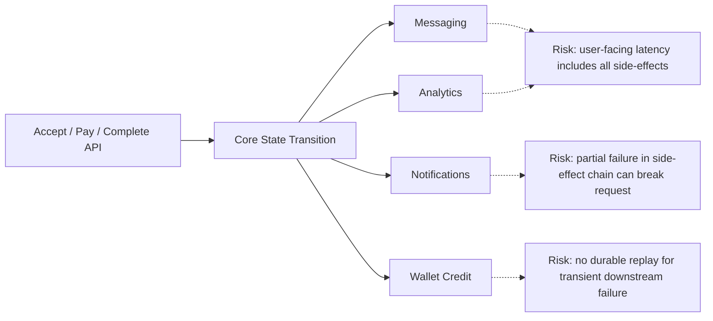
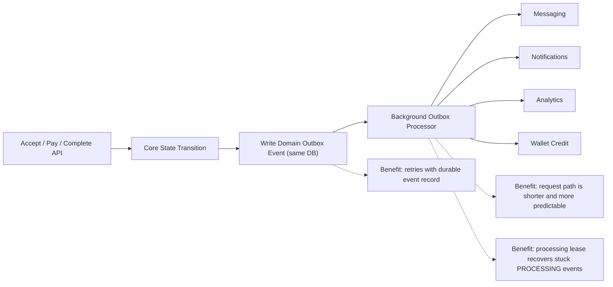
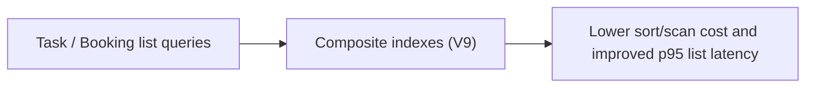

# Architecture Before vs After

## Before (Synchronous Side Effects In Request Path)

## After (Durable Outbox + Async Processing)

## Read Path Optimization

## Change Summary

- `acceptApplication`, payment callback, and booking completion now publish durable outbox events for side-effects.
- Side-effects (conversation bootstrap, notifications, analytics, wallet settlement) are processed asynchronously with
  retry.
- Outbox processing now uses a lease to recover events left in `PROCESSING` after crashes.
- Read-heavy listing flows now use new composite indexes (`tasks`, `task_applications`, `bookings`).
