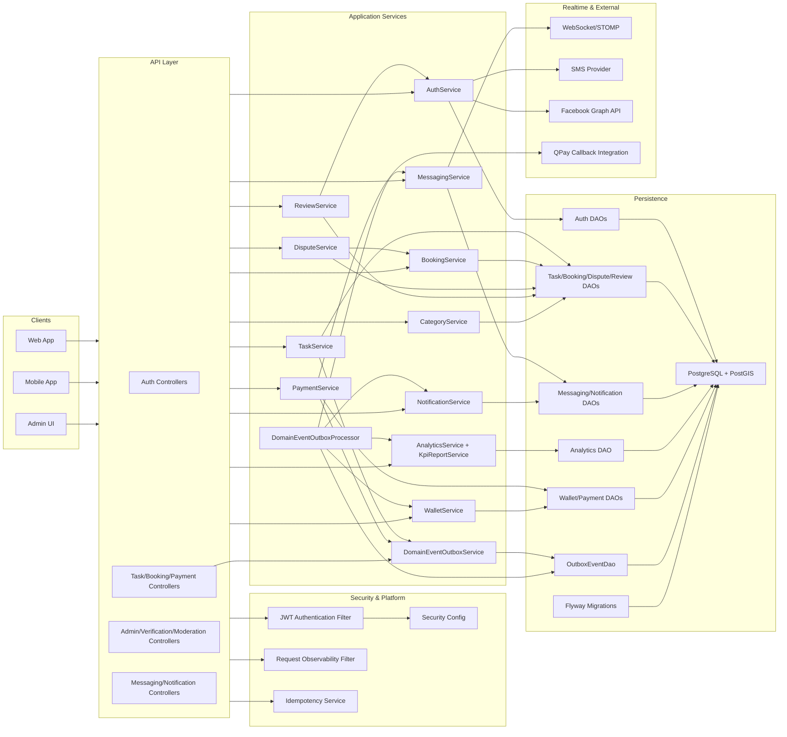

# Backend Architecture Overview

Derived from backend application-service Javadocs and package/module structure.

```mermaid
graph LR
  subgraph Clients
    Web["Web App"]
    Mobile["Mobile App"]
    AdminUI["Admin UI"]
  end

  subgraph API["API Layer"]
    AuthC["Auth Controllers"]
    TaskC["Task/Booking/Payment Controllers"]
    OpsC["Admin/Verification/Moderation Controllers"]
    CommC["Messaging/Notification Controllers"]
  end

  subgraph Security["Security & Platform"]
    JWTF["JWT Authentication Filter"]
    SecCfg["Security Config"]
    Obs["Request Observability Filter"]
    Idem["Idempotency Service"]
  end

  subgraph App["Application Services"]
    AuthS["AuthService"]
    TaskS["TaskService"]
    BookingS["BookingService"]
    PaymentS["PaymentService"]
    WalletS["WalletService"]
    DisputeS["DisputeService"]
    ReviewS["ReviewService"]
    MsgS["MessagingService"]
    NotifyS["NotificationService"]
    AnalyticsS["AnalyticsService + KpiReportService"]
    CategoryS["CategoryService"]
    OutboxPub["DomainEventOutboxService"]
    OutboxProc["DomainEventOutboxProcessor"]
  end

  subgraph Data["Persistence"]
    AuthDAO["Auth DAOs"]
    TaskDAO["Task/Booking/Dispute/Review DAOs"]
    CommDAO["Messaging/Notification DAOs"]
    AnalyticsDAO["Analytics DAO"]
    WalletDAO["Wallet/Payment DAOs"]
    OutboxDAO["OutboxEventDao"]
    DB["PostgreSQL + PostGIS"]
    Flyway["Flyway Migrations"]
  end

  subgraph Realtime["Realtime & External"]
    WS["WebSocket/STOMP"]
    SMS["SMS Provider"]
    FB["Facebook Graph API"]
    QPay["QPay Callback Integration"]
  end

  Web --> API
  Mobile --> API
  AdminUI --> API

  API --> JWTF
  API --> Obs
  JWTF --> SecCfg

  API --> AuthS
  API --> TaskS
  API --> BookingS
  API --> PaymentS
  API --> WalletS
  API --> DisputeS
  API --> ReviewS
  API --> MsgS
  API --> NotifyS
  API --> AnalyticsS
  API --> CategoryS
  API --> Idem

  AuthS --> AuthDAO
  TaskS --> TaskDAO
  BookingS --> TaskDAO
  PaymentS --> WalletDAO
  WalletS --> WalletDAO
  DisputeS --> TaskDAO
  ReviewS --> TaskDAO
  MsgS --> CommDAO
  NotifyS --> CommDAO
  AnalyticsS --> AnalyticsDAO
  CategoryS --> TaskDAO

  OutboxPub --> OutboxDAO
  OutboxProc --> OutboxDAO
  OutboxProc --> MsgS
  OutboxProc --> NotifyS
  OutboxProc --> AnalyticsS
  OutboxProc --> WalletS

  AuthDAO --> DB
  TaskDAO --> DB
  CommDAO --> DB
  AnalyticsDAO --> DB
  WalletDAO --> DB
  OutboxDAO --> DB
  Flyway --> DB

  MsgS --> WS
  AuthS --> SMS
  AuthS --> FB
  PaymentS --> QPay

  TaskS --> OutboxPub
  PaymentS --> OutboxPub
  TaskC --> OutboxPub
  ReviewS --> AuthS
  DisputeS --> BookingS
```
