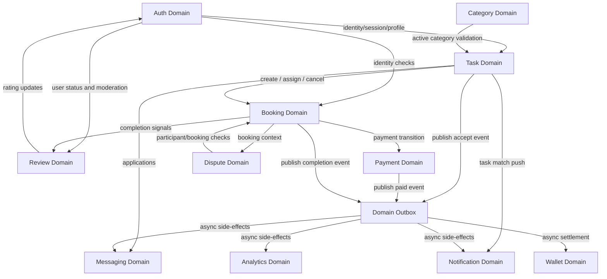

# Domain Interaction Map

Derived from backend application-service Javadocs.

```mermaid
graph TD
  Auth["Auth Domain"] -->|"identity/session/profile"| Task["Task Domain"]
  Auth -->|"user status and moderation"| Review["Review Domain"]
  Auth -->|"identity checks"| Booking["Booking Domain"]

  Category["Category Domain"] -->|"active category validation"| Task

  Task -->|"create / assign / cancel"| Booking
  Task -->|"applications"| Messaging["Messaging Domain"]
  Task -->|"task match push"| Notification["Notification Domain"]

  Booking -->|"payment transition"| Payment["Payment Domain"]
  Booking -->|"completion signals"| Review
  Booking -->|"booking context"| Dispute["Dispute Domain"]

  Outbox["Domain Outbox"] -->|"async side-effects"| Messaging
  Outbox -->|"async side-effects"| Notification
  Outbox -->|"async side-effects"| Analytics["Analytics Domain"]
  Outbox -->|"async settlement"| Wallet["Wallet Domain"]

  Task -->|"publish accept event"| Outbox
  Payment -->|"publish paid event"| Outbox
  Booking -->|"publish completion event"| Outbox

  Review -->|"rating updates"| Auth

  Dispute -->|"participant/booking checks"| Booking
```
