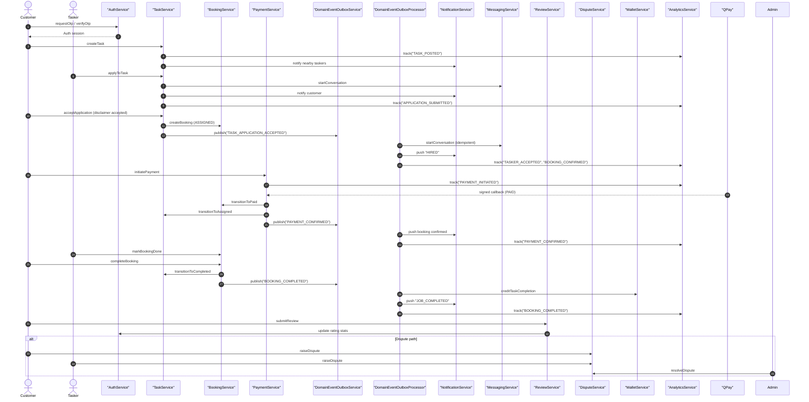

# Marketplace Business Flow

Derived from backend application-service Javadocs.

```mermaid
sequenceDiagram
  autonumber
  actor Customer
  actor Tasker
  participant Auth as "AuthService"
  participant Task as "TaskService"
  participant Booking as "BookingService"
  participant Payment as "PaymentService"
  participant Outbox as "DomainEventOutboxService"
  participant Worker as "DomainEventOutboxProcessor"
  participant Notify as "NotificationService"
  participant Msg as "MessagingService"
  participant Review as "ReviewService"
  participant Dispute as "DisputeService"
  participant Wallet as "WalletService"
  participant Analytics as "AnalyticsService"
  participant QPay as "QPay"

  Customer->>Auth: requestOtp / verifyOtp
  Auth-->>Customer: Auth session

  Customer->>Task: createTask
  Task->>Analytics: track("TASK_POSTED")
  Task->>Notify: notify nearby taskers

  Tasker->>Task: applyToTask
  Task->>Msg: startConversation
  Task->>Notify: notify customer
  Task->>Analytics: track("APPLICATION_SUBMITTED")

  Customer->>Task: acceptApplication (disclaimer accepted)
  Task->>Booking: createBooking (ASSIGNED)
  Task->>Outbox: publish("TASK_APPLICATION_ACCEPTED")
  Worker->>Msg: startConversation (idempotent)
  Worker->>Notify: push "HIRED"
  Worker->>Analytics: track("TASKER_ACCEPTED", "BOOKING_CONFIRMED")

  Customer->>Payment: initiatePayment
  Payment->>Analytics: track("PAYMENT_INITIATED")

  QPay-->>Payment: signed callback (PAID)
  Payment->>Booking: transitionToPaid
  Payment->>Task: transitionToAssigned
  Payment->>Outbox: publish("PAYMENT_CONFIRMED")
  Worker->>Notify: push booking confirmed
  Worker->>Analytics: track("PAYMENT_CONFIRMED")

  Tasker->>Booking: markBookingDone
  Customer->>Booking: completeBooking
  Booking->>Task: transitionToCompleted
  Booking->>Outbox: publish("BOOKING_COMPLETED")
  Worker->>Wallet: creditTaskCompletion
  Worker->>Notify: push "JOB_COMPLETED"
  Worker->>Analytics: track("BOOKING_COMPLETED")

  Customer->>Review: submitReview
  Review->>Auth: update rating stats

  alt Dispute path
    Customer->>Dispute: raiseDispute
    Tasker->>Dispute: raiseDispute
    Admin->>Dispute: resolveDispute
  end
```
