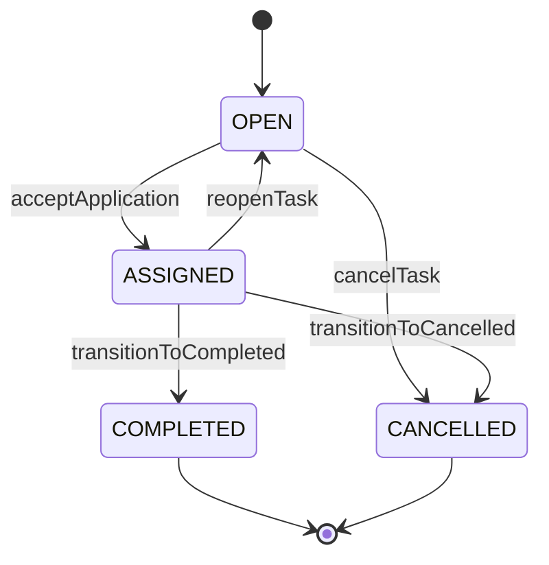
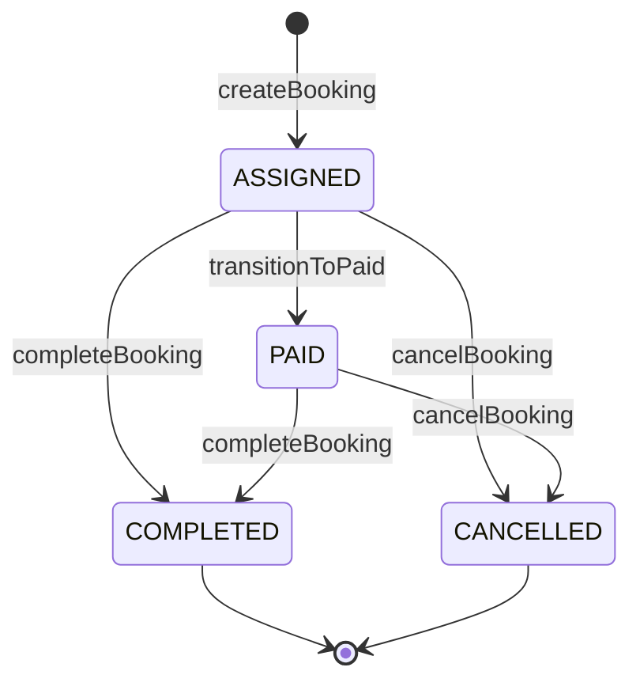
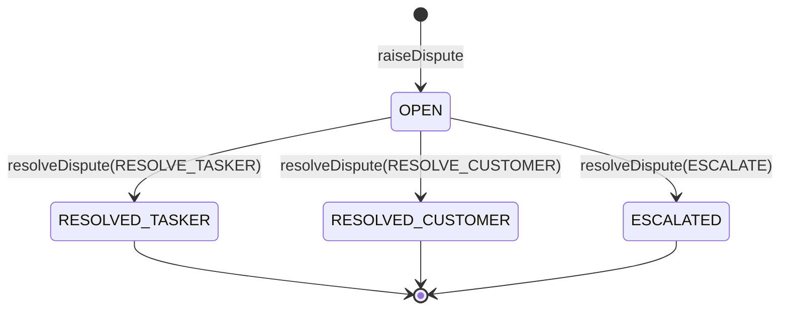

# Marketplace State Machines

Derived from backend application-service Javadocs.

## Task State

```mermaid
stateDiagram-v2
  [*] --> OPEN
  OPEN --> ASSIGNED: acceptApplication
  OPEN --> CANCELLED: cancelTask
  ASSIGNED --> OPEN: reopenTask
  ASSIGNED --> COMPLETED: transitionToCompleted
  ASSIGNED --> CANCELLED: transitionToCancelled
  COMPLETED --> [*]
  CANCELLED --> [*]
```

## Booking State

```mermaid
stateDiagram-v2
  [*] --> ASSIGNED: createBooking
  ASSIGNED --> PAID: transitionToPaid
  ASSIGNED --> COMPLETED: completeBooking
  ASSIGNED --> CANCELLED: cancelBooking
  PAID --> COMPLETED: completeBooking
  PAID --> CANCELLED: cancelBooking
  COMPLETED --> [*]
  CANCELLED --> [*]
```

## Dispute State

```mermaid
stateDiagram-v2
  [*] --> OPEN: raiseDispute
  OPEN --> RESOLVED_TASKER: resolveDispute(RESOLVE_TASKER)
  OPEN --> RESOLVED_CUSTOMER: resolveDispute(RESOLVE_CUSTOMER)
  OPEN --> ESCALATED: resolveDispute(ESCALATE)
  RESOLVED_TASKER --> [*]
  RESOLVED_CUSTOMER --> [*]
  ESCALATED --> [*]
```
