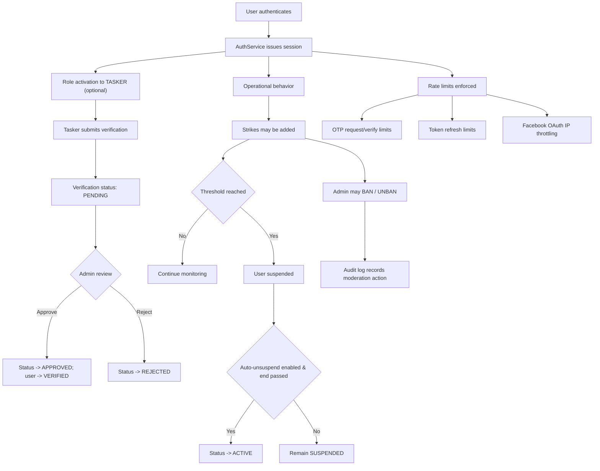

# Trust And Safety Lifecycle

Derived from backend application-service Javadocs.

```mermaid
flowchart TD
  A["User authenticates"] --> B["AuthService issues session"]
  B --> C["Role activation to TASKER (optional)"]
  C --> D["Tasker submits verification"]
  D --> E["Verification status: PENDING"]
  E --> F{"Admin review"}
  F -->|"Approve"| G["Status -> APPROVED; user -> VERIFIED"]
  F -->|"Reject"| H["Status -> REJECTED"]

  B --> I["Operational behavior"]
  I --> J["Strikes may be added"]
  J --> K{"Threshold reached"}
  K -->|"No"| L["Continue monitoring"]
  K -->|"Yes"| M["User suspended"]
  M --> N{"Auto-unsuspend enabled & end passed"}
  N -->|"Yes"| O["Status -> ACTIVE"]
  N -->|"No"| P["Remain SUSPENDED"]

  J --> Q["Admin may BAN / UNBAN"]
  Q --> R["Audit log records moderation action"]

  B --> S["Rate limits enforced"]
  S --> T["OTP request/verify limits"]
  S --> U["Token refresh limits"]
  S --> V["Facebook OAuth IP throttling"]
```
