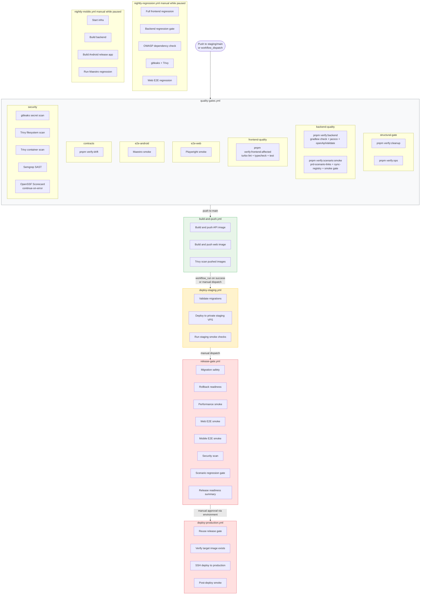

# CI Gate Architecture

Actual checked-in workflow topology, plus the lane placement relevant to the remediated governance design.



## verify:cleanup composition

```mermaid
flowchart LR
    CG[check-cleanup-gate.sh] --> OV[:services:api:openApiValidate]
    CG --> DC[repo:docs:check]
    CG --> TC[turbo typecheck]
    CG --> WB[repo:workspace:boundaries]
    CG --> MS[@tasky/mobile structure:check]
    CG --> VM[validate-migrations.py]
    CG --> VS[validate-schema-parity.py]
    CG --> TE[check-trivyignore-expiry.sh]
    CG --> GS[check-gitleaks-secret-scan.sh]
```

## Gate-to-command cross-reference

| Gate              | Command                                              | Scope                                            |
| ----------------- | ---------------------------------------------------- | ------------------------------------------------ |
| Cleanup           | `pnpm verify:cleanup`                                | Structural, docs, schema, migration              |
| Ops               | `pnpm verify:ops`                                    | Tooling surface and workflow wiring              |
| Docs              | `pnpm repo:docs:check`                               | Governance, design navigation/journeys, OpenAPI  |
| Backend           | `pnpm verify:backend`                                | Compile, test, coverage, OpenAPI                 |
| Frontend          | `pnpm verify:frontend`                               | Full lint, typecheck, test                       |
| Frontend affected | `pnpm verify:frontend:affected`                      | Merge-branch fast path                           |
| Scenario smoke    | `pnpm verify:scenario:smoke`                         | PRD-to-scenario links, registry sync, smoke gate |
| Drift             | `pnpm verify:drift`                                  | SDK drift and ArchUnit                           |
| Regression        | `./gradlew --no-daemon :services:api:gateRegression` | Extended backend scenario gate                   |
| Full              | `./gradlew --no-daemon gateFull`                     | Full suite plus PIT                              |

## Design implication for this proposal

`repo:design:check` is part of `repo:docs:check`, not `check-cleanup-gate.sh`. That keeps design-doc validation inside the same docs lane as governance, references, doc-claims, design-contracts, journey checks, and OpenAPI phase checks.
