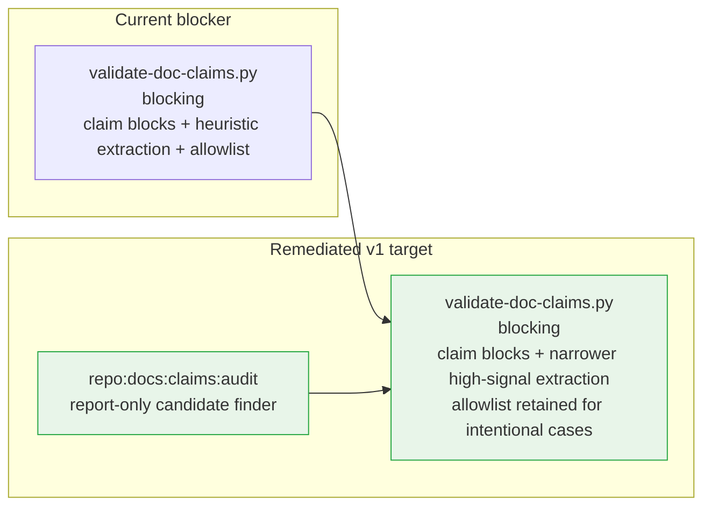

# Proposed Pipeline: Remediated Agent-Skill-Augmented Governance

This target state keeps blocking validation deterministic, reuses existing skill owners, and moves new design checks into the canonical docs lane. Changes from the current pipeline are marked `✦`.

```mermaid
flowchart TD
    REQ([Request / Bug / Execution Brief])
    REQ --> SKILL1

    subgraph SKILL1["intake-to-prd skill  (augmented)"]
        S1A[Read PRD + STRATEGY\n+ nearest maintenance policy] --> S1B{Behavior\nchanges?}
        S1B -->|Yes| S1C["✦ extract_prd_diff_ids.py\nchanged REQ-P1 / NFR IDs"]
        S1C --> S1D["✦ Per-ID ripple review\nmaintenance · architecture · scenarios\nopenapi · design · copy"]
    end

    S1B -->|Implementation only| IMPL
    S1D --> RIPPLE

    subgraph RIPPLE["Doc Propagation"]
        R1[docs/maintenance/]
        R2[docs/architecture/]
        R3[docs/openapi/** -> bundle -> API.yaml]
        R4[docs/design/**]
        R3 --> SDK_GEN["pnpm contract:sdk:generate  @tasky/sdk"]
    end

    RIPPLE --> DOCS_LANE

    subgraph DOCS_LANE["✦ repo:docs:check  (expanded docs lane)"]
        D1[check-doc-governance.py]
        D2[validate-doc-references.py]
        D3[validate-prd-scenario-links.py]
        D4[validate-doc-claims.py\nblocking validator retained]
        D5[validate-design-contracts.py\nexisting component-contract coverage]
        D6["✦ repo:design:check\nscreen · journey · lifecycle structure"]
        D7[validate-openapi-phase + bundle check]
        D1 --> D2 --> D3 --> D4 --> D5 --> D6 --> D7
    end

    DOCS_LANE --> SCENARIOS

    subgraph SCENARIOS["Scenario Curation  (curator only)"]
        SC1["Edit tests/scenarios/domain.md\nSCN-ID · Risk · PRD-ref · GWT"] --> SC2[sync-registry.sh]
        SC2 --> SC3[(tests/registry.yaml)]
    end

    SCENARIOS --> TESTS

    subgraph TESTS["Test Writing"]
        T1[Read scenario from registry] --> T2[@DisplayName SCN-XXX-NNN: title\nNo @SpringBootTest / @Autowired]
        T2 --> T3["gradlew :services:api:test\n-> surefire XML -> status covered"]
    end

    TESTS --> FIDELITY

    subgraph FIDELITY["✦ scenario-fidelity skill  NEW, report-only"]
        F1["find_weak_coverage.py\ncovered scenarios + weak signals"] --> F2["Review candidate tests\nstrengthen assertions where warranted"]
    end

    FIDELITY --> IMPL

    subgraph IMPL["Code Implementation  (unchanged)"]
        I1["Read api.md + module AGENTS.md"] --> I2["Implement in module\nHexagonal / CQRS / Outbox patterns"]
        I2 --> I3[ArchUnit boundaries enforced]
    end

    IMPL --> VERIFY

    subgraph VERIFY["Verification  (unchanged lanes, stronger docs lane)"]
        V1[verify:cleanup] --> V2[verify:backend]
        V2 --> V3[verify:scenario:smoke]
        V3 --> V4[verify:drift]
    end

    VERIFY --> CLAIMS

    subgraph CLAIMS["✦ doc-claims-remediation skill  (augmented)"]
        C1["repo:docs:claims:triage\nblocking failure summary"] --> C2["✦ repo:docs:claims:audit\nclaim-block candidates"]
        C2 --> C3[Fix stale prose first]
        C3 --> C4[Add claim block only where exactness matters]
        C4 --> DONE
    end

    DONE(["PR ready ✓"])

    style DOCS_LANE fill:#e8f5e9,stroke:#28a745
    style FIDELITY fill:#e8f5e9,stroke:#28a745
    style CLAIMS fill:#e8f5e9,stroke:#28a745
```

## What changes from the current pipeline

| Current                                                          | Proposed                                                              | Benefit                                                      |
| ---------------------------------------------------------------- | --------------------------------------------------------------------- | ------------------------------------------------------------ |
| PRD ripple is checklist-only inside `intake-to-prd`              | `intake-to-prd` gets a diff helper and a required per-ID ripple table | Better PRD-first discipline without adding a duplicate skill |
| Screen, journey, and lifecycle docs have no structural validator | `repo:design:check` is added under `repo:docs:check`                  | The docs lane owns design-doc structure end to end           |
| Doc-claims repair is reactive only                               | `doc-claims-remediation` gains proactive audit output                 | Better claim-block authoring without weakening the blocker   |
| `validate-doc-claims.py` is noisy in places                      | Heuristic extraction is narrowed carefully, but the blocker stays     | Lower noise without losing passive drift detection           |
| Covered scenarios can still hide weak assertions                 | `scenario-fidelity` produces report-only candidates                   | Better test triage without blocking on heuristics            |

## Skill inventory impact

| Skill                    | Status              | Bundled helper(s)                                                   | When to run                                                         |
| ------------------------ | ------------------- | ------------------------------------------------------------------- | ------------------------------------------------------------------- |
| `intake-to-prd`          | existing, augmented | `extract_prd_diff_ids.py`                                           | After editing `docs/PRD.md`                                         |
| `doc-claims-remediation` | existing, augmented | `triage_doc_claims.py`, `audit_unclaimed_refs.py`                   | On doc-claims failures and when proactively auditing doc assertions |
| `design-surface-drift`   | new                 | `check_screen_graph.py`, `check_journeys.py`, `check_lifecycles.py` | After editing screen, journey, or lifecycle design docs             |
| `scenario-fidelity`      | new                 | `find_weak_coverage.py`                                             | After writing tests; optionally in nightly informational runs       |

## Validate-doc-claims posture after remediation


