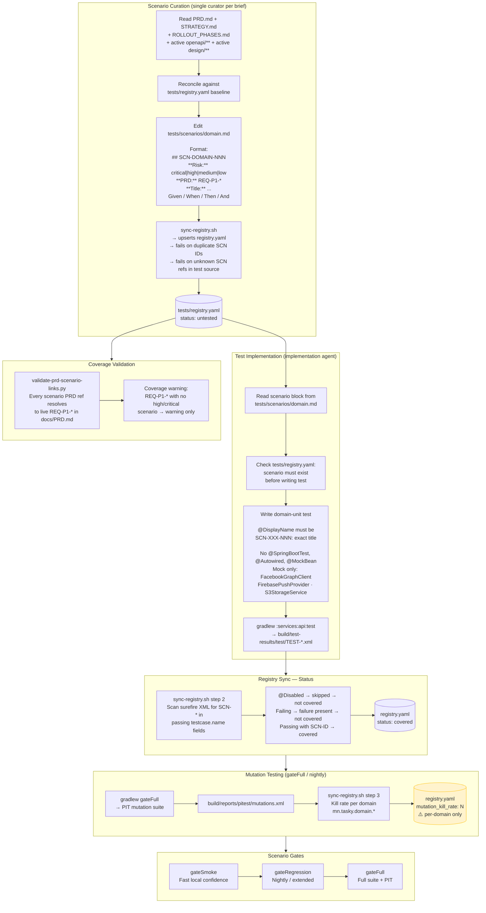
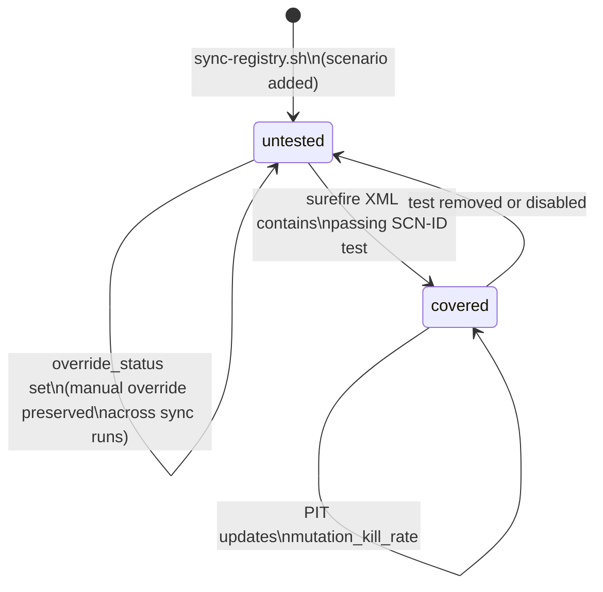

# Test Pipeline

Scenario-centric test lifecycle from curation to mutation coverage.



## Scenario ID format

```
SCN-{DOMAIN}-{NNN}
     ↑          ↑
     e.g.       zero-padded 3-digit
     AUTH       sequential per domain
     BOOK
     MSG
     ...
```

Domains map to files: `tests/scenarios/auth.md`, `tests/scenarios/booking.md`, etc.

## Test constraints table

| Rule                                                                        | Rationale                                                        |
| --------------------------------------------------------------------------- | ---------------------------------------------------------------- |
| `@DisplayName` must be `"SCN-XXX-NNN: <exact title>"`                       | sync-registry.sh parses it to link test → scenario               |
| No `@SpringBootTest` in domain-unit tests                                   | Spring context load is slow; unit tests target domain logic only |
| Mock only `FacebookGraphClient`, `FirebasePushProvider`, `S3StorageService` | Only external system boundaries; internal services must be real  |
| Never `@DirtiesContext`                                                     | Prevents context cache pollution across suite                    |
| If no scenario covers behavior — stop and report the gap                    | Agents must not invent scenario coverage                         |
| Curator is single-owner per execution brief                                 | Prevents concurrent scenario drift                               |

## Registry status lifecycle



## Known weaknesses

| Weakness                                          | Location                         | Impact                                                                     |
| ------------------------------------------------- | -------------------------------- | -------------------------------------------------------------------------- |
| Mutation kill rate is per-domain                  | `sync-registry.sh` step 3        | Weak assertions in one module hide behind high kill rate across the domain |
| Coverage check is ID-presence only                | `validate-prd-scenario-links.py` | A trivially-passing test counts as full coverage                           |
| Then/And line count vs. assertion count unchecked | No script today                  | Test can reference SCN-ID without exercising the scenario outcomes         |
