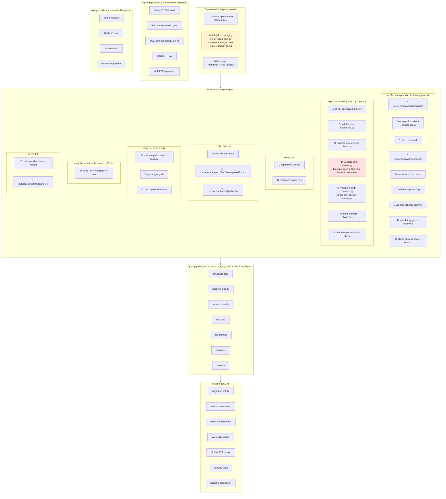
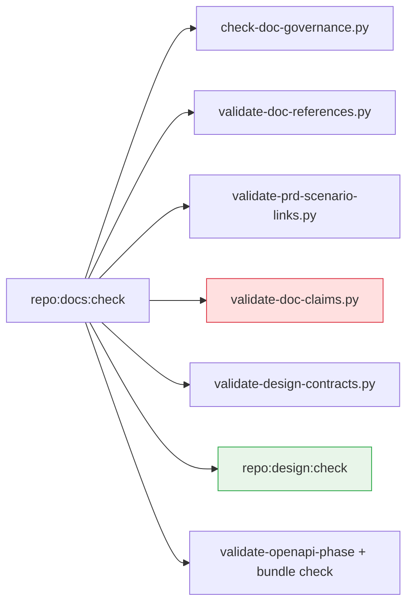

# Validation Layer

All validation hooks and scripts, showing where they run today, what they check, and where the remediated design should extend the stack.

## Current heuristic vs. deterministic summary

| Script / hook                    | Type today | Notes                                                          |
| -------------------------------- | ---------- | -------------------------------------------------------------- |
| `validate-doc-claims.py`         | H + D      | Blocking validator with claim blocks plus heuristic extraction |
| `validate-prd-scenario-links.py` | D          | ID lookup and risk-tier coverage warnings                      |
| `validate-schema-parity.py`      | D          | SQL parse plus JSON inventory diff                             |
| `validate-migrations.py`         | D          | Naming and immutability checks                                 |
| `validate-doc-references.py`     | D          | Path and pnpm script existence                                 |
| `validate-design-contracts.py`   | D          | `component-contract.yaml` only                                 |
| Pre-commit REQ-P1 gate           | H          | Staged diff scan; co-staging safeguard                         |

## Remediated optimization target

1. Add `repo:design:check` under `repo:docs:check` for `screen-graph.yaml`, `journey-catalog.yaml`, and `domain-lifecycles.yaml`.
2. Keep `validate-doc-claims.py` blocking, but narrow its noisiest extraction paths only if coverage is preserved.
3. Add `repo:docs:claims:audit` as a report-only helper under `doc-claims-remediation`.
4. Add `repo:prd:diff-ids` under `intake-to-prd` so PRD ripple becomes formalized without creating a new skill.
5. Add `verify:scenario:fidelity` as report-only triage rather than a blocking lane.

## Docs lane target after implementation

